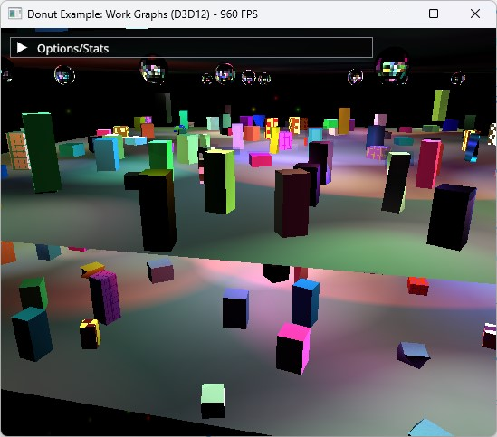

# Direct3D 12 work graphs sample

This sample demonstrates how to achieve GPU-driven shader launches using the [**D3D12 work graphs**](https://github.com/microsoft/DirectX-Specs/blob/master/d3d/WorkGraphs.md) API. In this sample, a large number of meshes animate on the screen in a typical deferred shading rendering environment. After the g-buffer is populated with only normals and material IDs, the sample applies deferred shading using tiled light culling and material shading. This is entirely achieved using one call to **DispatchGraph**. The sample has three variations of work graphs: one that uses tiled light culling and broadcasting launch nodes, and the second variant uses per-pixel light culling and coalescing launch nodes, and the third variant also uses per-pixel light culling but with thread launch nodes. Finally, a standard **Dispatch**-based implementation is provided for comparison.

### Work Graph Sample Code
The main focus of this sample is to showcase the use of the D3D12 Work Graphs API and compare it to previous methods to achieve the same results.

The work graph code is concentrated in a few locations in the sample code:
* **work_graphs_d3d12.cpp**:
	* `WorkGraphs::LoadWorkGraphPipelines`: Demonstrates how to compile the work graph library, and how to create the state object.
	* `WorkGraphs::PopulateDeferredShadingWorkGraph`: Demonstrates how to prepare and dispatch the work graph.
* **work_graph_broadcasting.hlsl**: The HLSL shader code for all nodes in the work graph, written as broadcasting launch nodes.

### Important Build Note
After cloning the sample and before building, please download the latest Direct3D Agility SDK and DirectX Compiler packages and extract the x64 binaries from them into the sample's file tree as follows:
https://www.nuget.org/packages/Microsoft.Direct3D.D3D12/1.613.0
Place the files **D3D12Core.dll** and **D3D12SDKLayers.dll** in the **donut_examples\examples\work_graphs\AgilitySDK** folder.

https://www.nuget.org/packages/Microsoft.Direct3D.DXC/1.8.2403.18
Place the files **dxc.exe**, **dxcompiler.dll** and **dxil.dll** in **donut_examples\examples\work_graphs\DXC_bin_x64** folder.

This step will be fixed and removed soon. Sorry for the inconvenience in the mean time.

### Details
#### Scene
The scene is made of multiple floors, where each floor is populated by an animating crowd of energetic cuboids. The ceiling is populated with reflective balls that cast moving lights on each floor.

This scene is fully procedurally generated to allow resizing flexibly. There are a number of controls to manage scene complexity (number of meshes, lights and materials).

There are a few types of meshes in the scene: flat plane (used for floors), sphere (used for light balls), and cube (used for the cuboids). During rendering, these meshes are instantiated and randomly placed around the scene. They are animated by a few simple methods (scaling, twist, rotation, translation) which are driven by a special animation compute shader.

The scene is lit only by spot lights. Spot lights are defined by their two end points and two angles (inner fully lit angle, and outer angle). The spot lights dynamically move their target point.

Each mesh is assigned a material from a material library. Materials can use one of several types (or "BRDFs") which render in a certain way (e.g. Lambert, Phong, Metallic, Velvet, ...etc). Each material has its own variation of colors and other parameters (e.g. roughness, patterns, flake sizes, ...etc). Evaluating a material requires checking its type first, then executing the shader code that knows how to shade that material under a given light. The list of supported material types can be found in **scene.h**, and material evaluation code can be found in **materials.hlsli**.

All scene controls can be found grouped at the top of the file **scene.cpp**. Those can be used to control scene size, floor count, mesh count, light count, material count and other parameters to stress test scene performance in various areas.

The scene's camera and animation speed controls can be found a little down from the beginning of the file **work_graphs_d3d12.cpp**. These parameters are all defined in relation to the scene's size, so tweaking them is not necessary even after changing scene parameters mentioned above.

#### Deferred Shading Using Standard Compute Shaders
The sample starts by running a compute shader that updates the scene's animation on the GPU (done by shader file **animation.hlsl**). After which, the G-buffer fill pass is done. In this pass, all meshes in the scene are iterated over and are submitted for drawing. There is no culling to meshes in this sample.

The g-buffer pass fills a single RGBA16 render target with the following information (RGB: World-space normal, A: Material index). The shader file for this step is **gbuffer_fill.hlsl**.

After the g-buffer pass, lighting is done using one of four techniques: standard deferred shading compute, work graphs (broadcasting launch), work graphs (coalescing launch) and work graphs (thread launch).

The standard deferred shading compute pass is done using two compute dispatches:
1. **Tiled light culling**: The screen is divided to tiles 8x4 pixels each. For each tile, all lights affecting that tile are collected and stored in a buffer. There is a maximum number of lights that can be collected in each tile, and that number is configurable (`DeferredShadingParam_MaxLightsPerTile` in **work_graphs_d3d12.cpp** and `c_MaxLightsPerTile` in **lighting.hlsli**). The shader file for this step is **light_culling.hlsl**.
2. **Deferred shading using uber shader**: Each tile is processed again. This time using the lights collected by the tile, all materials found in the tile are evaluated in an uber shader. The shader file for this step is **deferred_shading.hlsl**.

#### Broadcasting Launch Work Graph
The work graph technique completely replaces the two steps mentioned above in the standard deferred shading compute pass (tiled light culling, and deferred shading uber shader).

This version uses broadcasting launch nodes to replicate the same concept of tiled light culling. The root node of the graph (`LightCull_Node`) is executed for each screen tile. The node does light culling and store the result in a record to be sent to the next step of the graph.

The root node can target an array of outputs, where each output is specialized for a certain material type (or a screen clear), called `Material_Nodes`. The culled lights list is placed in a record that is sent to the correct node in the graph that can handle the type of material in the tile.

In the case a tile containing multiple different material types, the root node spawns multiple records to cover the same tile using different material type nodes.

When launching the work graph for the first time, the work graph's backing memory must be initialized by passing a special flag to work graph's program descriptor.

#### Performance tuning and controls

* The g-buffer pass performance is tied to the number and triangle density of the meshes in the scene. The CPU performance is also mainly scaled linearly by the number of meshes in the scene, as no scene acceleration structures are used in the sample.
* The lighting passes (of all techniques) are mainly affected by the number of lights and how many types of materials are supported.
* The maximum number of lights handled per tile affects the standard deferred shading pass and the broadcasting launch work graph. Under-estimating this value will result in some blocky lighting artifacts on the screen. This value also controls storage size in both the culled lights buffer used by the standard deferred shader, as well as the size of the material node record used in the work graphs.